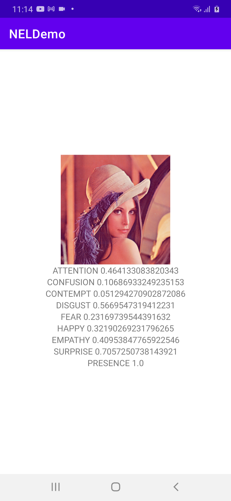

# NELDemo

This is a demonstration of the basic usage of the NEL library in and Android project.

the app...
- loads a static image
- runs the NEL library detection on the image
- prints the results as follows

©2020 - Realeyes | All right reserved | https://www.realeyesit.com/